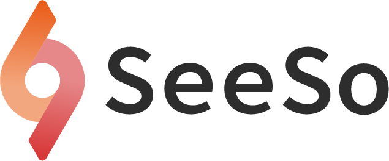

<p align="center">
    
</p>
<div align="center">
    <h1>SeeSo Flutter Sample</h1>
    <a href="https://github.com/visualcamp/seeso-sample-flutter" alt="release">
    </a>
</div>

## SeeSo
SeeSo is an AI based eye tracking SDK which uses image from RGB camera to track where the user is looking.
Extra hardware is not required and you can start your development for free.
In 2021, SeeSo was recognized for its innovative technology and won GLOMO Award for Best Mobile Innovation for Connected Living!

1. Supports multi-platform (iOS/Android)
2. Has simple and quick calibration (1-5 points)
3. Has high accuracy and robustness compared to its competitors.


## Documentation
* Overview: https://docs.seeso.io/docs/document/seeso-sdk-overview
* Quick Start: https://docs.seeso.io/nonversioning/quick-start/flutter-quick-start
* API: https://docs.seeso.io/docs/api/flutter-api-docs

## Requirements

### Android
* minSdkVersion: 23
* targetSdkVersion: 30

### iOS
* iOS Version : 13 + 
* iOS Device : iPhone 6s +

### Common
* It must be run on a real device.
* It must be an internet environment.
* Must be issued a license key in [SeeSo Manage](https://manage.seeso.io/)

## Setting License Key
* Get a license key from https://manage.seeso.io and copy your key to [`seeso_provider.dart`](/lib/provider/seeso_provider.dart#L21)
   ```dart
   //todo Please enter the key value for development issued by the SeeSo.io
  const String licenseKey = "Input your license key.";
   ```

## How to run
1. Clone or download this project.
2. Install Flutter pub 
   ```bash
   flutter pub get
   ```
3. Install cocoapods for iOS.
   ```bash
   pod install
   ```
4. Connected Real device and Run.


## Contact Us
If you have any problems, feel free to [contact us](https://seeso.io/Contact-Us) 
